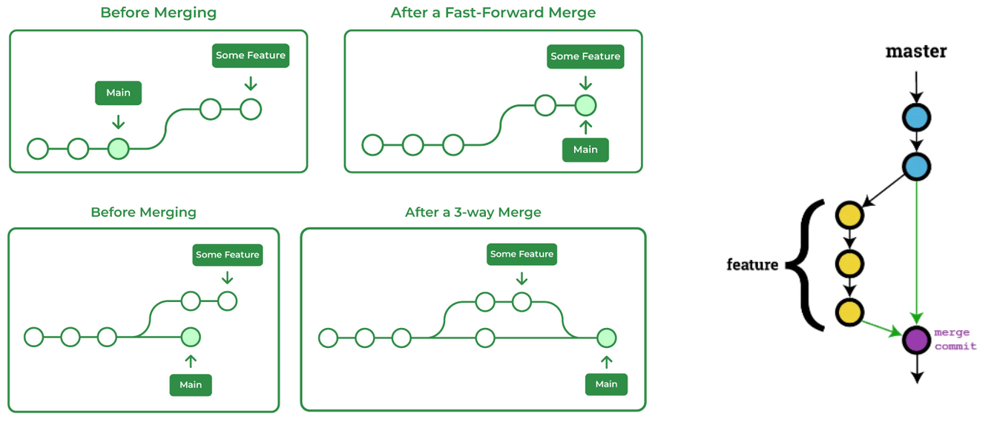
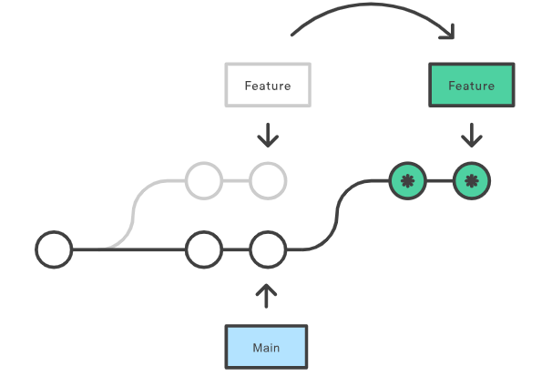
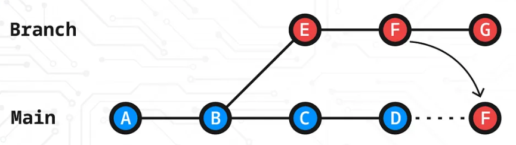

# Git

### **Git Workflow Stages**

Working Directory -> Staging Area -> Local Repository -> Remote Repository

<details><summary>Remove old gitHub credentials</summary>

Control Panel > User Accounts > Manage your Credentials> Windows Credentials - Remove Github link under Generic Credential`

</details>

<details><summary>Git Workflow Commands</summary>

```bash
git --version

git update-git-for-windows

git ls-files

git rm <file_name>
git rm --cached <file_name>
git rm -r --cached <folder_name>

git mv <original_file_name> <rename_file_name>
git mv <file_name> <new_folder_name_or_path>

git init

git clone <github_repo_URL>

git pull origin <branch_name>
git pull --rebase

git remote -v
git remote add origin <remote_repo_URL>
git remote set-url origin <new_remote_repo_URL>

git add .
git add <file_name>
git add \*<file_extension>

git status
git status -s

git commit -m "<message>"

# Commit history
git log
git log --oneline --all --graph
git log --oneline --reverse

# Working directory ⟶ Staging area (index).
git diff
git diff <file_name>

# Staging area ⟶ Last commit (HEAD).
git diff --cached
git diff --cached <file_name>

# Two specific commits.
git diff <commit_hash1> <commit_hash2>
```

</details>

<details><summary>Git Branch</summary>

```bash
git branch

git branch <branch_name>

git checkout -b <branch_name>

git switch -c <branch_name>
git checkout <branch_name>

git branch -d <branch_name>

git branch -m <current_branch_name> <new_branch_name>

git diff <branch_name>
git diff <branch1> <branch2>

git push -u origin <branch_name>
git push -d origin <branch_name>

# Delete remote branch,
git push origin --delete <branch_name>

# For remote renaming branch: change the branch name in local first and push that branch to origin, and delete the existing branch using above cmd.

# Lists remote-tracking branches
git branch -r

# Lists local branches
git branch -vv
```

</details>

<details><summary>Git Merge</summary>

- Fast-Forward merge, Non-Fast forward merge, 3-way merge, and Rebase

<p align="center">
  
  
</p>

```bash
git merge <branch_name>
git merge --no-ff <branch_name>

git rebase <branch_name>

git branch --merged
git branch -r --merged

git branch --no-merged
git branch -r --no-merged
```

</details>

<details><summary>Git reset</summary>

```bash
git reset --soft <commit_hash>
git reset --mixed <commit_hash>
git reset --hard <commit_hash>
```

**A → B → C → D → E (HEAD)**

Suppose you run: `git reset --soft C`

| Mode      | Commits msg/ hash D & E Deleted? | Code from D & E Present? | State of Working Dir |
| --------- | -------------------------------- | ------------------------ | -------------------- |
| `--soft`  | ✅ Yes                           | ✅ Yes (in staging)      | ✅ Same as E         |
| `--mixed` | ✅ Yes                           | ✅ Yes (Working Dir)     | ✅ Same as E         |
| `--hard`  | ✅ Yes                           | ❌ No                    | ⏪ Rolled back to C  |

</details>

<details><summary>Reset Specific Files to a Previous Commit</summary>

```bash
git restore --source=<commit-hash> -- path/to/file
git restore --source=<commit-hash> -- path/to/file1 path/to/file2
```

</details>

<details><summary>Move files from the staging area back to the working directory</summary>

```bash
git restore --staged <filename>
git restore --staged .
```

</details>

<details><summary>Git Stash</summary>

- Git Stash allows you to store only the Staging area by default, so first we need to add to the Staging area, then stash.

```bash
git stash list

git stash push -m "<stash_message>"
git stash push -u -m "<stash_message>"
git stash push -a -m "<stash_message>"

git stash apply stash@{0}

git stash drop stash@{0}

git stash clear
```
```
0 (first-stash)   0 (second-stash)   0 (third-stash)
                  1 (first-stash)    1 (second-stash)
                                     2 (first-stash)
```

</details>

<details><summary>Organising Commit History</summary>

```bash
git rebase -i <commit_hash>

pick => reword (edit the commit message)

pick => squash (meld into previous commit, and after that it ask new commit message)

pick => fixup (like "squash" but keep only the previous commit message, and it doesn't ask new commit message)
```

</details>

<details><summary>Git Tags</summary>

```bash
git tag

git tag <v1.0> <commit_hash>
git tag -d <v1.0>

git push origin <v1.0>
git push origin --delete <v1.0>
```

</details>

<details><summary>Git Release</summary>

A Git release is always tied to a Git tag, which serves as a marker/ version for a specific commit in your repository's history.

</details>

<details><summary>Cherry Pick</summary>

To copy the commit code into our current commit without merging.

```bash
git cherry-pick <commit_hash>
```



</details>

<details><summary>Initial Setup</summary>

```bash
git config --global user.name <name>
git config --global user.name

git config --global user.email <email>
git config --global user.email
```

```bash
git config --global core.editor "code --wait"

git config --global core.autocrlf true
git config --global core.autocrlf input
```

#### **Git aliases** are like shortcuts for longer Git commands.

```.gitconfig
git config --global -e

[core]
    editor = \"C:\\Users\\Admin\\AppData\\Local\\Programs\\Microsoft VS Code\\bin\\code\" --wait
    autocrlf = true
[color]
    ui = auto
[user]
    name = Sharath M
    email = sharathmahadeva@mirafra.com
[alias]
    up = update-git-for-windows
    lg = log --oneline --all --graph --decorate
    logs = log --graph --abbrev-commit --decorate \
        --format=format:'%C(bold blue)%h%C(reset) - %C(bold green)(%ar)%C(reset) %C(white)%s%C(reset) %C(dim white)- %an%C(reset)%C(auto)%d'
    s  = status -sb
    stat = !git status -sb | sed \
        -e 's/^ M/Modified (unstaged): /' \
        -e 's/^M /Modified (staged): /' \
        -e 's/^A /Added: /' \
        -e 's/^R /Renamed: /' \
        -e 's/^C /Copied: /' \
        -e 's/^U /Unmerged: /' \
        -e 's/^??/Untracked: /' \
        -e 's/^D /Deleted: /'
    co = checkout
    cb = checkout -b
    br = branch
    cm = commit -m
[init]
    defaultBranch = main
```

</details>

<details><summary>SSH key generation</summary>

- SSH key generation creates a pair of cryptographic keys, a private key and a public key, used for secure, passwordless authentication between your local machine and a remote server (like GitHub, GitLab, or a Linux VM).
- Private key (id_rsa or ~/.ssh/id_ed25519): stays securely stored on your local system (never shared).
- Public key (id_rsa.pub or  ~/.ssh/id_ed25519.pub): uploaded to the remote host (e.g., GitHub).

When you connect via SSH, the remote server uses the public key to verify your private key, proving your identity without sending any passwords.

```bash
ssh-keygen -t rsa -b 4096 -C "your_email@example.com"
```
```bash
ssh-keygen -t ed25519 -C "work-account" -f ~/.ssh/id_ed25519_work
```

- `-t`: Specifies the encryption type (RSA, Ed25519, etc.)
- `-b`: Number of bits in the key (higher = more secure)
- `-C`: Adds a comment (usually your email for identification)
- `-f`: custom name and prevents overwriting your existing key

</details>

<details><summary>Teammates should do after getting private repo access</summary>

- Generate SSH key on their laptop: `ssh-keygen -t rsa -b 4096 -C "their_email@example.com"`
- Add their public SSH key to GitHub: `cat ~/.ssh/id_rsa.pub` 
  - Then go to: GitHub → Settings → SSH and GPG keys → New SSH key → Paste it → Save
- Test SSH connection: `ssh -T git@github.com`
  - If successful: Hi username! You've successfully authenticated, but GitHub does not provide shell access.

- Clone your private repo: `git clone git@github.com:your-username/your-repo-name.git`

</details>

<details><summary>Trunk-Based Development — Daily Workflow</summary>
  
1. Pull the latest changes from trunk: Keep your local main branch up to date before starting any new work.
2. Create a short-lived feature branch: Make small, focused changes only
3. Implement and test locally: Run all test cases before pushing to avoid continuous integration (CI) failures.
4. Push your branch and create a Pull Request: Create a PR only if there are no merge conflicts.
5. If merge conflicts exist: Pull the latest trunk, resolve conflicts locally, commit and push again, then reopen or update the pull request.
6. After CI passes successfully: Merge the pull request into the trunk (main branch).

</details>
